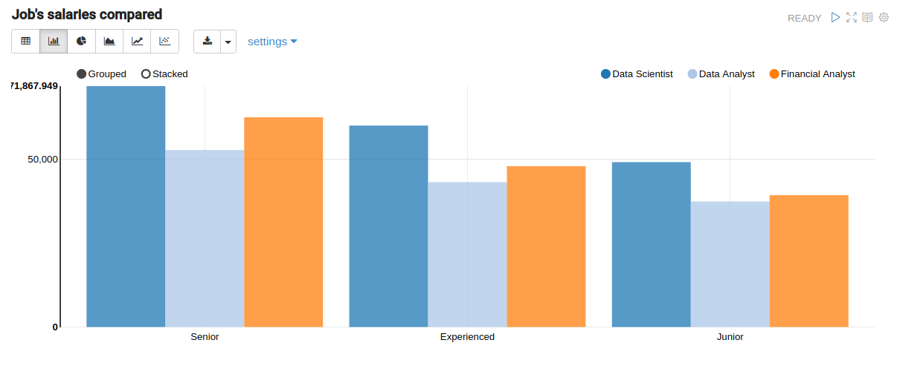
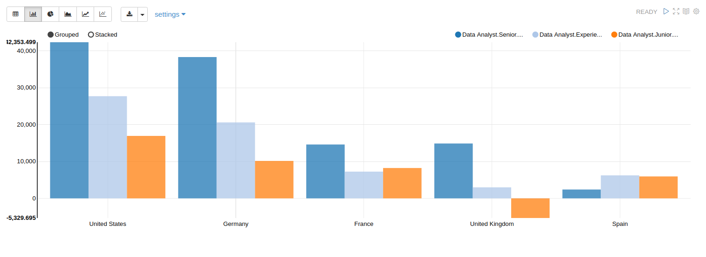
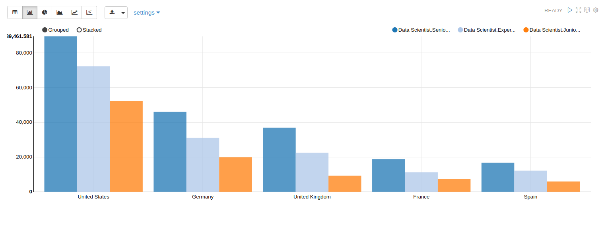
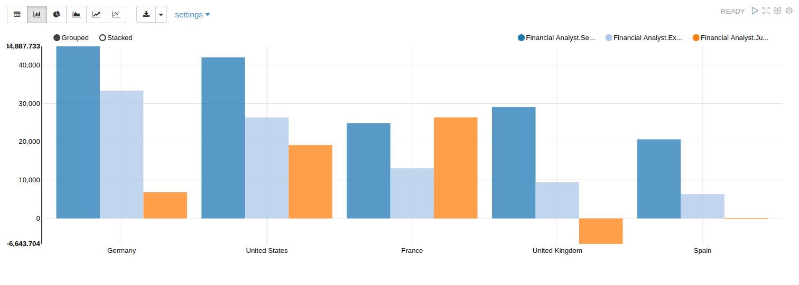



# Title of My Project
Our future

*[Javier Pardo, Miquel Petit, Onur Taskin, Laurent Guerguy, Barcelona June 2019]*

## Content
- [Project Description](#project-description)
- [Hypotheses / Questions](#hypotheses-/-questions)
- [Dataset](#dataset)
- [Workflow](#workflow)
- [Organization](#organization)
- [Results](#results)
- [Links](#links)

## Project Description
Data is information, and as long as it is relevant, it’s a tool to study the past, so we can look into the future. So, what else can we do but to try discovering ours? And that’s what’s this project is all about, looking for available roles in different countries and comparing them with each other in order to get the most profitable (even in a non economical sense) option.
To do the analysis the following countries have been selected: United States, Germany, France, United Kingdom and Spain for the selected positions: Data Analyst, Financial Analyst and Data Scientist.

## Hypotheses / Questions
-USA will have the greatest salaries, but not so much life quality
-Spain will have the lowest salaries, but great life quality
-France and UK will be average, higher salaries than in Spain, but less happiness too
-Germany will have both; life quality and high salaries

## Dataset
The data has been selected among different platforms such as Glassdoor (using web scraping to collect the data of average salaries) and Numbeo for the cost of living https://www.numbeo.com/cost-of-living/)

[Dataset]() 

## Workflow
First of all, it is necessary to have a clear mind, to know what to do, and after that, start planning about it. 
Once we have finished the planning, we divide the work by the capacities of each member so we all can work in something we are good at. 
Then, communicating is essential: you can’t work without your team, so even if you have stuff to do on your own, you need to know the work of the team and interact with it, giving feedback and contributing.

## Organization
Our method was simple: Communication. You need nothing but interaction with all the members of the team to get it done, you just need to understand your role in the team and the work and once you do just go on. 
Of course, we did use tools to get things more friendly, as the board to explain and agree and Trello to remember those decisions.

## Results

Before we can answer the question of which is the best country to work after the bootcamp, we first need to choose the job we’ll compare. We have taken the roles of Data Analyst, Data Scientist and Financial Analyst, and we have also segmented it by the experience so we get closer to the reality: Junior, Experienced and Senior.

### Hypothesis
Below we show the hypothesis we had before we start our analysis. We'll check if they are proved to be true or not at the end of the study.

NOTE: As all the salaries are not comparable in different countries, the measure we are taking is the "absolute wealth" in euros, simply calculated subtracting the average living cost of each country to the salary of each job.

Before we start analysing the data we have the following hypothesis:
- USA will have the highest absolute wealth
- Spain will have the lowest absolute wealth
- France and Uk will be average
- Germany will have Europe’s best absolute wealth

### Job salaries per experience
We have designed the following plot aiming to compare the jobs by experience so the data is more similar, it wouldn’t make sense to compare the salary of a Senior job with a Junior job.

As expected the average salary increases from Junior to Senior for each type of job.
The lowest salary is obtained for the role of Data Analyst followed by Financial Analyst and then the role of Data Scientist.

### Where is it better to work?
In each of the following three graphs, for each of the jobs, we plot the data of the salaries by countries and experience. 
In this way, we can see in which countries that job is better paid. 
As all the salaries are not comparable in different countries, the measure we are taking is the "absolute wealth", simply calculated subtracting the average living cost of each country to the salary of each job. That's why there can be some columns in negative.

**Data Analyst**

NOTE: The average salaries from Spain and France do not follow the logical trend of being higher with more experience. This can be explained as in the Glassdoor portal we scraped it says this data has low confidence. 

**Data Scientist**

**Financial Analyst**

### Hypothesis check
How do the results compare to our initial hypothesis?
- USA will have the highest absolute wealth
This is indeed true. The USA is where the salaries are the highest in our comparison.

- Spain will have the lowest absolute wealth
Surprisingly this is not the case as can be seen when comparing Spain with the UK for jobs such as Data Analyst and Financial Analyst.

- France and UK will be average
In some instances (as seen in the example above) the UK is below Spain in terms of absolute wealth.

- Germany will have Europe’s best absolute wealth
Germany is indeed the Europan country with the highest absolute wealth.

So to summarize the answer to the question: "Where is the best place to work (if you want to acheive maximum wealth)?" is the USA.

## Links
Include the links to your repository, slides and trello. Feel free to include any other links associated to your project. 

[Repository](https://github.com/laurent-guerguy/Project-Week-3-Data-Thieves)  
[Slides](https://docs.google.com/presentation/d/1m0xFWtrLkFqyTV18vBOaCVWPSI2eD1FRu4USx9TKgEU/edit#slide=id.g5d807e7d24_0_398)  
[Trello](https://trello.com/b/TMKJQqPc/project-3-data-thieves)  
